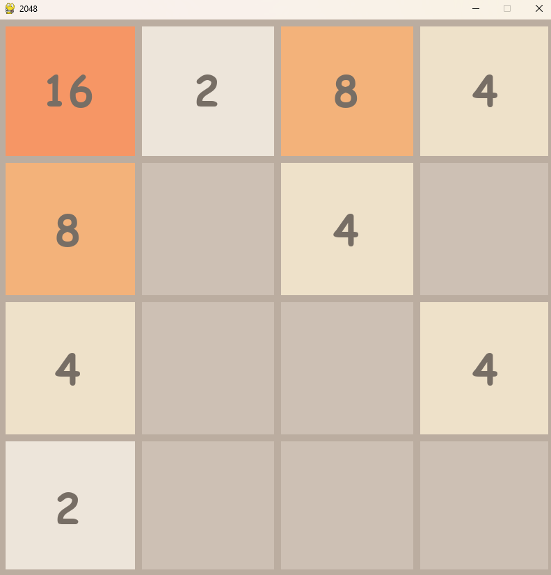

# 2048 Game

## Description

A classic 2048 game implemented in Python using the Pygame library.

Still needs some fixing.

## Prerequisites

- **Python**: Ensure you have Python installed on your system. You can download Python from [python.org](https://www.python.org/downloads/).
- **Visual Studio Code**: Download and install VSCode from [code.visualstudio.com](https://code.visualstudio.com/).
- **Python Extension for Visual Studio Code**: Install the Python extension for VSCode from the Extensions Marketplace.

## Installation and Running

1. **Clone the Repository**:

    `git clone https://github.com/dgrabo/2048-game.git`

2. **Running the Game**:

    In the top right corner in Visual Studio Code, pres `Run Code` button.

## How to Play

- Use the arrow keys on your keyboard to move the tiles:
  - Up Arrow: Move tiles up
  - Down Arrow: Move tiles down
  - Left Arrow: Move tiles left
  - Right Arrow: Move tiles right
- When two tiles with the same number touch, they merge into one.

## Screenshot

Here’s a screenshot of the game in action:

